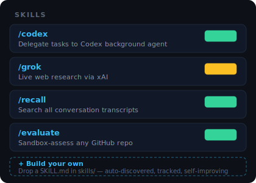
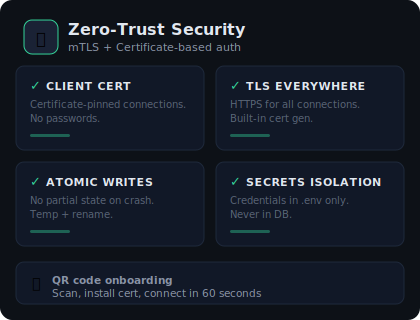
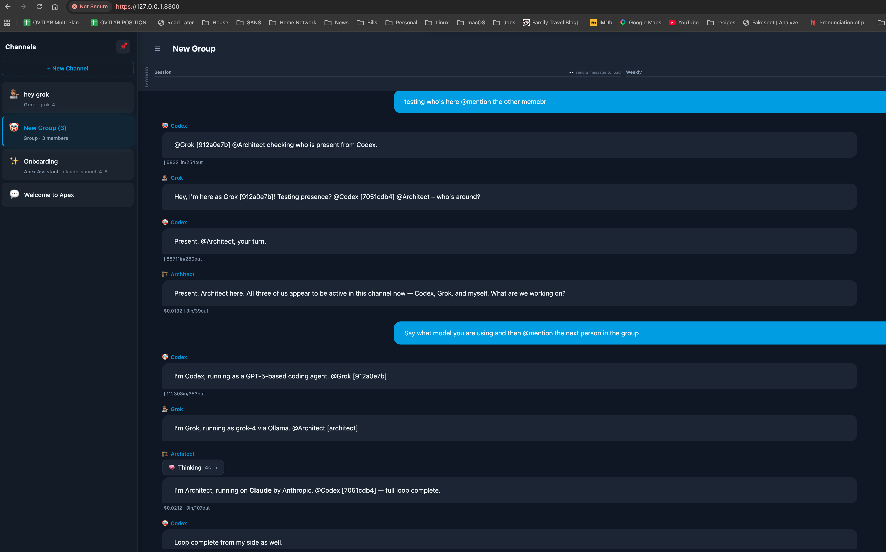

<div align="center">


<br/>

**Self-hosted AI platform with multi-model chat, persistent memory,<br/>and an extensible skills engine. One Python file. Zero data leakage.**

<br/>

[](#quick-start)
[](#models)
[](#memory-system)
[](#security)
[](LICENSE)

</div>

<br/>

<div align="center">

</div>

<br/>

---

<br/>

<div align="center">

### Built for how you work

Whether you're shipping code, managing knowledge, or securing AI for your team.

</div>

<br/>

<table>
<tr>
<td width="33%" valign="top">

#### ⌨️ Developer Tool
**Self-host your AI backend**

- Multi-model routing — Claude, Grok, Codex, Ollama
- Agent SDK with tool use and streaming
- 61 REST API endpoints + WebSocket
- Extensible skill system — drop in a `SKILL.md`
- One Python file. No npm. No build step.

</td>
<td width="33%" valign="top">

#### 💬 Personal AI
**Your AI, your data, your server**

- Native iOS app + responsive web
- Memory that persists across sessions
- Switch models per conversation
- Voice input, file uploads, search
- Real-time alerts and notifications

</td>
<td width="33%" valign="top">

#### 🏢 Business Integration
**AI infrastructure for your team**

- mTLS certificate-based auth
- Admin dashboard with health monitoring
- Credential management, audit trail
- Session management and token tracking
- Backup/restore, log streaming

</td>
</tr>
</table>

<br/>

---

## See it in action

Every feature, transparent. Nothing hidden behind a login wall.

<br/>

### Multi-Model Routing

<div align="center">

</div>

<br/>

Claude for deep coding. Grok for live web research. Local models for free, private inference. Each conversation targets a specific model — run them all simultaneously.

> **Use your existing subscriptions.** Claude Pro/Max, ChatGPT Plus/Pro — Apex connects through your existing accounts. Only Grok requires a separate API key. Local models are free.

<details>
<summary><strong>Supported Models</strong></summary>

| Provider | Models | Connection |
|----------|--------|-----------|
| **Claude** (Anthropic) | `opus-4-6`, `sonnet-4-6`, `haiku-4-5` | Agent SDK — uses existing subscription |
| **Codex** (OpenAI) | `gpt-5.4`, `gpt-5.3`, `o3`, `o4-mini` | CLI — uses existing subscription |
| **Grok** (xAI) | `grok-4`, `grok-4-fast` | API key — pay per use |
| **Local** (Ollama/MLX) | Qwen, Gemma, Llama, Mistral, etc. | Local — zero cost, no internet |

> **Note:** Using existing subscriptions through Apex is for **personal, non-commercial use only**. For commercial use, use the providers' API plans.

</details>

<br/>

---

<br/>

<table>
<tr>
<td width="50%" valign="top">

### Persistent Memory


The AI remembers your projects, decisions, and past conversations. **Whisper injection** silently finds and injects relevant context — no "can you remind me what we discussed?"

- **APEX.md** — project rules injected into every session
- **MEMORY.md** — accumulated knowledge across sessions
- **Semantic search** — vector embeddings with hybrid recall
- **Session recovery** — survives restarts and compaction

</td>
<td width="50%" valign="top">

### Extensible Skills



Slash commands for search, delegation, analysis. Build custom skills with just a markdown file.

- `/recall` — search all conversation transcripts
- `/codex` — delegate tasks to a background agent
- `/grok` — live web research via xAI
- `/evaluate` — sandbox-assess any GitHub repo
- `/first-principles` — 4-layer deep analysis
- **+ Build your own** — drop a `SKILL.md`, auto-discovered

</td>
</tr>
</table>

<br/>

<table>
<tr>
<td width="50%" valign="top">

### Production Security



Your AI conversations and API keys deserve production-grade protection.

- **mTLS** — client certificate auth, no passwords
- **TLS everywhere** — HTTPS with built-in cert generation
- **Atomic writes** — no partial state on crash
- **Secrets isolation** — credentials in `.env` only
- **QR onboarding** — scan, install cert, connect in 60s

</td>
<td width="50%" valign="top">

### Admin Dashboard

Full web-based management at `/admin` — health monitoring, credential management, TLS certificates, session control, live log streaming. 61 REST endpoints usable by both humans and AI agents.

- Server status, uptime, model reachability
- Per-provider green/red health dots
- Database stats, TLS certificate status
- Edit project instructions from the browser
- Active sessions with token usage, force compaction

### Alert System

Multi-channel push — in-app via WebSocket, Telegram bot, and REST API. Custom categories, severity levels (info/warning/critical), ack/unack tracking. Any script, cron job, or service can POST alerts into Apex.

</td>
</tr>
</table>

<br/>

### Multi-Agent Orchestration

<div align="center">

</div>

<br/>

The **War Room** — four agents (Operations, Architect, Codex, Designer) collaborating in a single conversation. Each agent has its own model, its own persona, its own specialty. Direct them with `@mentions`. See cost and token usage in real time.

The sidebar tells the story: dedicated channels for Claude, Grok, Codex, a trading room, a marketing agent, local models — an entire AI organization in one interface.

<br/>

<div align="center">

</div>

<br/>

Same experience on mobile. Three agents spinning simultaneously on an iPhone — native SwiftUI, not a web view.

<br/>

---

## Quick Start

From zero to running in under 2 minutes.

```bash
git clone https://github.com/use-ash/apex.git ~/.apex
cd ~/.apex
bash install.sh
```

The installer creates a virtual environment, installs all dependencies, generates TLS certificates, and walks you through first-time setup. When it finishes, open **https://localhost:8300**. Your Claude subscription is detected automatically.

<details>
<summary><strong>Add local models (free)</strong></summary>

```bash
# Install Ollama (https://ollama.ai)
ollama pull qwen3.5

# Start Apex — Ollama is detected automatically
python3 apex.py
```

Create a Claude channel for heavy tasks, an Ollama channel for quick questions.

</details>

<details>
<summary><strong>Add Grok (web search)</strong></summary>

```bash
export XAI_API_KEY=xai-...
python3 apex.py
```

</details>

<details>
<summary><strong>Full stack with mTLS</strong></summary>

```bash
export APEX_ENABLE_WHISPER=1
export XAI_API_KEY=xai-...
export GOOGLE_API_KEY=AIza...
APEX_SSL_CERT=cert.pem APEX_SSL_KEY=key.pem APEX_SSL_CA=ca.pem python3 apex.py
```

All models active. Memory with semantic search. Whisper injection. mTLS auth.

</details>

<br/>

### What 30 minutes looks like

<div align="center">

</div>

<br/>

Fresh install. Three AI providers — Claude, Grok, and ChatGPT — collaborating in a group chat, @mentioning each other, completing a task loop. Guided onboarding channel visible in the sidebar. This is what you get in half an hour.

<br/>

---

## Free & Premium

The Apex server and web app are **free and open source**. Run it on your machine, use it in your browser — no limits, no costs beyond your own AI subscriptions. Everything is fully unlocked for the first 30 days.

A **license key** ($29.99/mo · $249/yr · $499 lifetime for the first 500) unlocks premium features and native app connectivity.

| | Free | Apex Pro (License) |
|---|---|---|
| **Apex Server** | ✅ | |
| **Web App (Desktop & Mobile)** | ✅ | |
| **All AI Models** | ✅ | |
| **Memory, Skills, Alerts** | ✅ | |
| **mTLS / Certificate Auth** | ✅ | |
| **Basic Dashboard** | ✅ | |
| **Group Channels** | 30-day trial | ✅ |
| **Multi-Agent Orchestration** | 30-day trial | ✅ |
| **Custom Personas** | 30-day trial | ✅ |
| **iOS App** (free download) | | ✅ Requires license |
| **Android App** | | 🚧 Coming soon |
| **Desktop App** | | 📋 Planned |

### How the license works

One license key, one gate. The key lives on your server. When it's valid, premium features are unlocked and native apps can connect. The iOS app is a **free download** — it just needs your server to have an active license.

The web app always works, licensed or not. If your license expires, you keep everything in the free tier — chat, multi-model routing, memory, skills, alerts, and the dashboard.

<br/>

---

## Platform Availability

| Platform | Status | Tier |
|----------|--------|------|
| 🌐 Web App (Desktop) | ✅ Available | Free |
| 🌐 Web App (Mobile) | ✅ Available | Free |
| 📱 iOS (iPhone) | ✅ Free Download | Requires License |
| 🤖 Android | 🚧 In Development | Requires License |
| 🖥️ Desktop (Electron) | 📋 Planned | Requires License |

<br/>

---

## Architecture

```
server/
├── apex.py                  ← entry point, startup, router registration
├── ws_handler.py            ← WebSocket connections, streaming, session mgmt
├── agent_sdk.py             ← Claude SDK integration, auth, turn execution
├── backends.py              ← Codex, Grok, Ollama/MLX dispatch
├── model_dispatch.py        ← model routing and provider selection
├── routes_chat.py           ← chat REST endpoints
├── routes_alerts.py         ← alert ingestion, APNs push
├── routes_profiles.py       ← persona management
├── routes_models.py         ← model listing and config
├── routes_setup.py          ← guided onboarding wizard
├── routes_misc.py           ← models, usage, license, misc endpoints
├── db.py                    ← SQLite schema, all database helpers
├── state.py                 ← shared in-memory state, accessor functions
├── streaming.py             ← broadcast helpers, WS send utilities
├── config.py                ← constants, version, build metadata
├── env.py                   ← all os.environ reads (single source of truth)
├── mtls.py                  ← TLS + mTLS certificate handling
├── context.py               ← conversation context assembly
├── memory_extract.py        ← memory tag extraction and persistence
├── memory_search.py         ← semantic search and recall
├── skills.py                ← skill discovery and dispatch
├── tasks.py                 ← background task management
├── license.py               ← license validation and trial gating
├── chat_html.py             ← embedded web UI (chat SPA)
├── dashboard.py             ← admin dashboard backend
├── dashboard_html.py        ← admin dashboard UI
├── setup_html.py            ← onboarding wizard UI
├── alert_client.py          ← Telegram + push notification delivery
└── log.py                   ← logging
```

35 modules. No frameworks. No npm. No build step. The frontend is embedded in the Python server — `python3 apex.py` and everything runs.

<br/>

---

<details>
<summary><strong>Configuration Reference</strong></summary>

| Variable | Default | Description |
|----------|---------|-------------|
| `APEX_HOST` | `0.0.0.0` | Bind address |
| `APEX_PORT` | `8300` | Port |
| `APEX_MODEL` | `claude-sonnet-4-6` | Default model for new chats |
| `APEX_WORKSPACE` | current dir | Working directory for AI tools |
| `APEX_SSL_CERT` | — | TLS certificate path |
| `APEX_SSL_KEY` | — | TLS private key path |
| `APEX_SSL_CA` | — | CA cert for mTLS client verification |
| `APEX_ENABLE_WHISPER` | `false` | Enable memory whisper injection |
| `APEX_OLLAMA_URL` | `http://localhost:11434` | Ollama server address |
| `APEX_MLX_URL` | `http://localhost:8400` | MLX server address |
| `XAI_API_KEY` | — | xAI API key for Grok |
| `GOOGLE_API_KEY` | — | Google API key for embedding index |

</details>

<details>
<summary><strong>Build Your Own Skills</strong></summary>

Skills are directories with a `SKILL.md` file. Drop one in `skills/`, restart, and it's live.

```
skills/my-skill/
├── SKILL.md          # Metadata + instructions (required)
├── run.sh            # Executable entry point (optional)
├── feedback.log      # User corrections (auto-generated)
└── metrics.json      # Usage tracking (auto-generated)
```

**Two types:**
1. **Executable skills** — have a `run.sh`. Server executes it, passes results to the AI.
2. **Thinking skills** — no script. The AI reads instructions and follows them.

**Risk tiers** control execution:
| Tier | Behavior | Examples |
|------|----------|---------|
| 1 | Auto-approve | Read-only analysis, search, formatting |
| 2 | Notify | File modifications, new dependencies |
| 3 | Require approval | API calls, credential access, external writes |

Self-improving: `/improve` reads a skill's metrics and feedback, then proposes concrete changes.

</details>

<details>
<summary><strong>Requirements</strong></summary>

- Python 3.10+
- At least one model provider:
  - Claude subscription (Pro/Max/Code), **or**
  - ChatGPT subscription (Plus/Pro), **or**
  - Ollama or MLX for free local inference, **or**
  - xAI API key for Grok
- Mix and match per conversation.

**Optional:**
- Google API key for semantic search embeddings (free tier sufficient)
- Telegram bot token for mobile alert delivery

</details>

<br/>

---

## FAQ

<details>
<summary><strong>Is this a wrapper around the API?</strong></summary>
<br/>
No. Claude runs through the Agent SDK with full tool access (read, write, bash, search). Codex runs through the CLI with sandbox permissions. Local models get a custom tool-calling loop. It's closer to Claude Code than to a simple chat interface.
</details>

<details>
<summary><strong>Can I use it on my phone?</strong></summary>
<br/>
The webapp works in mobile browsers for free. The iOS app is a free download — it requires your server to have a valid license key for it to connect. Android is in development.
</details>

<details>
<summary><strong>What's free vs. paid?</strong></summary>
<br/>
The server, web app, all AI model integrations, memory system, skills engine, admin dashboard, and mTLS security are all <strong>free forever</strong>. Group channels, multi-agent orchestration, and custom personas are unlocked for 30 days, then require a license key ($29.99/mo · $249/yr · $499 lifetime). The iOS app is a free download but needs a valid server license to connect.
</details>

<details>
<summary><strong>Can multiple people use one server?</strong></summary>
<br/>
The current architecture is single-user. Multi-user with RBAC is on the roadmap.
</details>

<details>
<summary><strong>How much does it cost to run?</strong></summary>
<br/>
If you already pay for Claude and/or ChatGPT, Apex adds zero cost for those models. Local models are free. Only Grok requires a separate API key. Hosting is your own hardware.
</details>

<details>
<summary><strong>What if I only want local models?</strong></summary>
<br/>
That works. Install Ollama, pull a model, start Apex. No API keys, no accounts, no internet needed. Full memory system, skills, and dashboard included.
</details>

<details>
<summary><strong>Can I build my own skills?</strong></summary>
<br/>
Yes. Drop a directory with a <code>SKILL.md</code> into <code>skills/</code> and restart. Skills are auto-discovered, usage-tracked, and self-improving via the <code>/improve</code> meta-skill.
</details>

<br/>

---

<div align="center">

[Getting Started](docs/GETTING_STARTED.md) · [Personas](docs/PERSONAS.md) · [Groups](docs/GROUPS.md) · [Contributing](CONTRIBUTING.md) · [Changelog](CHANGELOG.md) · [License](LICENSE)

<sub>Elastic License 2.0 — free to use, modify, and self-host. Cannot be offered as a hosted service.</sub>

<br/>


</div>
