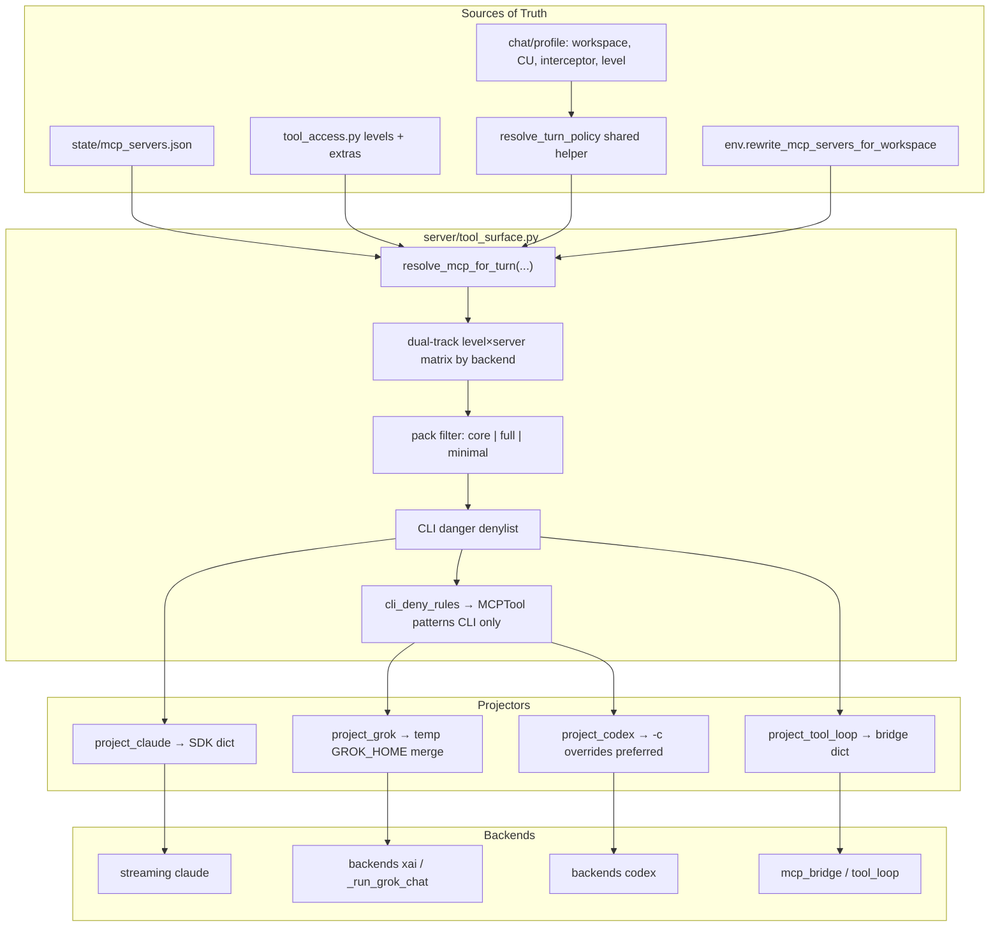

# Unified Apex Tool Surface for Claude, Codex, and Grok

| Field | Value |
|-------|-------|
| **Author** | (design agent) |
| **Date** | 2026-07-09 |
| **Status** | Approved (rev 7 — 2026-07-10). **PR1a–PR2 merged.** PR0 spikes done — `docs/PR0_TOOL_SURFACE_SPIKES.md`. Next: **PR3 Codex projector**. |
| **Branch** | `dev` only (`~/.openclaw/apex`) — never edit on `main` / prod worktree |
| **Scope** | OSS-suitable (`server/tool_surface.py` + call-site rewires). Personal MCP paths stay in `state/mcp_servers.json` / private overlays. |

---

## Overview

Apex already has a single MCP catalog (`state/mcp_servers.json`), a workspace rewriter (`env.rewrite_mcp_servers_for_workspace`), and a shared permission policy (`server/tool_access.py`). Only two execution paths consume that catalog today:

1. **Claude Agent SDK** — `streaming._load_mcp_servers` + inject helpers attach MCP onto `ClaudeAgentOptions`.
2. **Tool-loop** (Ollama / MLX / some remote OpenAI-compat) — `local_model/mcp_bridge.py` loads the same JSON and exposes `server__tool` schemas.

**Codex CLI** (`backends._run_codex_chat`) and **Grok CLI** (`backends._run_grok_chat`, backend id **`xai`**) spawn external agents with their own builtins and **ignore** Apex MCP entirely. Grok’s docstring is explicit: *“Grok CLI owns its own tools/sandbox/MCP.”*

This design introduces **`server/tool_surface.py`** as the single source of truth (SoT) for “what MCP servers does this turn get?” It resolves catalog + injects + profile extras + level filters once, then **projects** that set into each backend’s native format:

| Backend id | Projector | Isolation strategy (locked after review) |
|------------|-----------|------------------------------------------|
| `claude` | SDK dict | In-process options (unchanged shape) |
| `tool_loop` | bridge config | Shared loader; **per-chat roots still a known gap** (see Tool-loop) |
| `xai` (Grok) | temp `GROK_HOME` | Symlink sessions/auth; **copy+merge** real `config.toml` MCP sections |
| `codex` | **prefer real `CODEX_HOME` + `-c` overrides** | Avoid moving sessions; temp home only if spike fails |

Chat-scoped env (`APEX_CHAT_ID` / `APEX_DB_NAME` / workspace) is injected into MCP server specs without mutating the user’s durable global configs permanently.

---

## Background & Motivation

### Current state (verified 2026-07-09, branch `dev`)

| Backend id | Entry | MCP attachment today |
|------------|-------|----------------------|
| `claude` | `streaming._build_sdk_options` → Agent SDK | Loads `state/mcp_servers.json`; injects `execute_code`, claim_store env, `computer_use`, `interceptor`, `guide_tools`. Gate: `tool_access.tool_access_decision` via `can_use_tool` + PreToolUse hooks. |
| `tool_loop` | `backends._run_ollama_chat` → `local_model.tool_loop.run_tool_loop` | Builtins from `local_model/registry.py` + MCP from `mcp_bridge._load_mcp_config` (same JSON). Level filter: `allowed_tool_names_for_level`. **Global bridge:** filesystem roots fixed at first `initialize()`, not per-chat. |
| `codex` | `backends._run_codex_chat` | CLI builtins only. Apex currently sets `CODEX_CONFIG_DIR=~/.codex-api` for API-key models (`o3`/`o4-mini`). **Verified on Dana’s machine (2026-07-09):** modern `codex` binary exposes **`CODEX_HOME` only** (no `CODEX_CONFIG_DIR` string refs); `~/.codex-api` is an **empty** directory. Treat current Apex env as likely **dead / ineffective** until re-verified. |
| `xai` | `backends._run_grok_chat` (routed when `model_dispatch.get_model_backend("grok-*") → "xai"`) | CLI owns tools. Spawn: `-p`, `--cwd`, `--always-approve`, `--permission-mode bypassPermissions`, `--no-plan`, optional `-r` resume. No Apex MCP. Auth preferred OIDC; `XAI_API_KEY` optional. Sessions live under `$GROK_HOME/sessions` (default `~/.grok/sessions`). |

**Naming rule:** Apex backend id is **`xai`**, not `"grok"`. UI/model ids may say `grok-4.5`; policy flags and `BackendKind` use `xai`. Optional alias `grok→xai` at the resolve boundary only.

### Catalog (`state/mcp_servers.json`)

Enabled stdio servers (personal paths — not hard-coded in OSS code):

- `filesystem`, `playwright`, `fetch`, `memory`, `code-review-graph`, `tradingview`, `google-drive`, `claim_store`

Auto-injects (Claude path only, in `streaming.py` today):

| Inject | Exact condition today | Script |
|--------|----------------------|--------|
| `execute_code` | `jupyter_client` importable + script exists + not already in catalog | `local_model/mcp_execute_code.py` |
| `claim_store` env | server present in catalog + `chat_id` | sets `APEX_CHAT_ID` only (preserves other env e.g. `APEX_DB_NAME`) |
| `computer_use` | **darwin** + non-empty chat `computer_use_target` + script exists + not already configured | `local_model/mcp_computer_use.py` |
| `interceptor` | **darwin** + chat `interceptor_enabled` + script exists + **binary exists** (`APEX_INTERCEPTOR_BIN` or `~/.interceptor/bin/interceptor`) + not already configured | `local_model/mcp_interceptor.py` |
| `guide_tools` | **`if extra_allowed_tools:`** (any extras — including gate-test claim extras today, not only `sys-guide`) | `local_model/mcp_guide_tools.py` |

**Guide inject lock (through P2):** keep condition **`if extra_allowed_tools:`** exactly as today (gate-test extras also get `guide_tools` MCP). Do **not** tighten to `sys-guide` only in PR1a/PR1b/PR2. Optional later PR may tighten; out of scope until then.

### Pain points

1. **Capability skew** — Same chat switched from Claude → Grok/Codex loses fetch, playwright, memory, tradingview, claim_store (when policy would allow), etc.
2. **Duplicated load logic** — `_load_mcp_servers` (streaming) and `_load_mcp_config` (mcp_bridge) both parse the same JSON; injects only live on the Claude path.
3. **Chat-scoped env is fragile** — claim_store needs `APEX_CHAT_ID` / `APEX_DB_NAME` per chat; CLI paths never set these.
4. **Policy asymmetry** — Claude gets runtime `tool_access_decision`. CLIs with `--always-approve` cannot re-use that gate mid-call; they need **pre-filter** (pack + level matrix + Grok `--deny MCPTool(...)` fine filter) + CLI-native sandbox.
5. **Process tax** — Naïve “attach all MCP on every CLI spawn” multiplies cold `npx` starts per turn.
6. **Resume/auth coupling** — CLI session stores live under real homes; any temp-home design must not orphan `-r` / `exec resume`.

### Related recent work

- Grok routed to CLI (`feat(grok)` d997099 / 63878f0) — OIDC preferred over API key.
- Attachments blocked for Grok/Codex (`validate_backend_attachments` checks `backend == "xai"` / `"codex"`).
- User preference: stay on OIDC; attachments deferred (out of scope for this design’s critical path).

---

## Goals & Non-Goals

### Goals

1. **One resolve path** for enabled MCP + injects + profile extras + permission-level filtering.
2. **Parity of *catalog access*** across Claude, tool-loop, Grok (`xai`), Codex when policy admits a server (not “same builtins”).
3. **No permanent mutation** of user global `~/.grok/config.toml` or `~/.codex/config.toml`.
4. **Correct chat env on CLI and Claude** — `APEX_CHAT_ID`, `APEX_DB_NAME`, workspace roots, permission level propagate into MCP subprocess specs. (**Tool-loop per-chat roots: known gap until P3+** — Goal 4 does **not** claim full tool_loop workspace parity in P0–P2.)
5. **Safe-by-default for CLI** — deny high-risk MCP; claim_store and execute_code not in default CLI core; keep level gates.
6. **Use real CLI admission knobs** — Grok `--deny`/`--allow` with `MCPTool(...)` in P1; Codex equivalent when available.
7. **Documented process budget** — core pack vs full pack; measurable spawn cost.
8. **OSS-clean module** — no `/Users/dana/` hardcoding in `tool_surface.py`.
9. **Shared turn policy resolver** for all backends (level, profile_id, extras, workspace roots).

### Non-Goals

- Re-enabling or requiring `XAI_API_KEY` (OIDC remains primary for Grok).
- Attachment support for Grok/Codex (P4, separate design).
- Replacing Claude builtins or Codex/Grok builtins with Apex tool-loop builtins.
- Full mid-call Apex interception inside Grok/Codex agent loops (we use admission + CLI deny rules, not a reimplemented tool loop).
- Unifying skills/plugins marketplaces across CLIs.
- Changing Dashboard MCP CRUD API shape (may *call* resolve for preview only).
- V3 / private-only tooling.
- Fixing per-chat filesystem roots on the **global** mcp_bridge in P0 (deferred; documented gap).

---

## Proposed Design

### Architecture



### Shared turn policy resolver

Today only `_run_ollama_chat` and Claude SDK paths fully resolve level/extras. Codex/Grok resolve workspace (and Codex sandbox) but **not** permission level / extras.

**New helper** (live in `tool_surface.py` or thin wrapper in `backends.py` extracting from `_run_ollama_chat` + `_resolve_sdk_permission_level`):

```python
@dataclass(frozen=True)
class TurnPolicy:
    permission_level: int
    allowed_commands: list[str]
    profile_id: str
    extra_allowed_tools: frozenset[str]
    workspace_roots: list[str]
    computer_use_target: str | None
    interceptor_enabled: bool


def resolve_turn_policy(chat_id: str) -> TurnPolicy:
    """
    Same semantics as tool-loop / group dispatch:
    - profile_id = _current_group_profile_id.get("") or chat.profile_id
    - tool_policy from profile if profile_id else chat
    - extras = resolve_profile_extra_tools(profile_id)
    - workspace_roots from policy.workspace if set else env runtime roots
    - computer_use_target / interceptor_enabled from chat row
    """
    ...
```

**All** of `_run_grok_chat`, `_run_codex_chat`, `_run_ollama_chat`, and Claude `_build_sdk_options` (or its callers) must use this helper so multi-agent group turns get the speaking persona’s level/extras.

### Module: `server/tool_surface.py`

Public API:

```python
from __future__ import annotations
from dataclasses import dataclass, field
from pathlib import Path
from typing import Literal

# Apex backend ids — match model_dispatch / ws_handler, not product names
BackendKind = Literal["claude", "codex", "xai", "tool_loop"]
PackKind = Literal["core", "full", "minimal"]

def normalize_backend(backend: str) -> BackendKind:
    """Map aliases: grok → xai. Raise/log on unknown."""
    if backend == "grok":
        return "xai"
    ...

# Default CLI packs (tunable via state/config.json → policy.tool_surface)
# claim_store and execute_code are NOT in default core (see admission matrix)
CORE_PACK_SERVERS: frozenset[str] = frozenset({
    "filesystem", "fetch", "memory",
})
FULL_PACK_SERVERS: frozenset[str] | None = None  # None = all resolved except CLI denylist

CLI_DEFAULT_DENY_SERVERS: frozenset[str] = frozenset({
    "computer_use", "interceptor",
})


@dataclass(frozen=True)
class ResolvedMcpServer:
    name: str
    command: str
    args: list[str] = field(default_factory=list)
    env: dict[str, str] = field(default_factory=dict)
    cwd: str | None = None
    transport: str = "stdio"  # only stdio in v1
    source: str = "catalog"   # catalog | inject
    strip_enabled_key: bool = True  # Claude SDK wants strip; bridge historically kept it


@dataclass(frozen=True)
class ResolvedToolSurface:
    chat_id: str
    backend: BackendKind
    permission_level: int
    profile_id: str
    workspace_roots: list[str]
    pack: PackKind
    servers: dict[str, ResolvedMcpServer]
    extra_allowed_tools: frozenset[str]
    denied_servers: tuple[tuple[str, str], ...]  # (name, reason)
    cli_deny_rules: tuple[str, ...]  # PR0-recorded 'MCPTool(<wire_name>)' strings
    debug: dict


def resolve_mcp_for_turn(
    *,
    chat_id: str,
    backend: BackendKind | str,
    turn: TurnPolicy | None = None,
    pack: PackKind | None = None,
    allow_cli_dangerous: bool = False,
    # P0 extract mode: pass rewrite_workspace=None to mean "runtime roots only"
    # matching today's streaming._load_mcp_servers() call with no chat roots.
    rewrite_workspace: str | list[str] | None | object = ...,
) -> ResolvedToolSurface:
    ...


def project_claude(surface: ResolvedToolSurface) -> dict[str, dict]:
    """SDK shape: command/args/env; strip enabled keys (current streaming behavior)."""
    ...


def project_grok(
    surface: ResolvedToolSurface,
    *,
    real_grok_home: Path | None = None,
) -> tuple[Path, dict[str, str], list[str]]:
    """
    Returns (temp_home, env_overrides, extra_cli_args).
    extra_cli_args includes repeated --deny/--allow for MCPTool rules.
    """
    ...


def project_codex(
    surface: ResolvedToolSurface,
    *,
    real_codex_home: Path | None = None,
) -> tuple[list[str], dict[str, str], Path | None]:
    """
    Preferred: (codex_-c_args, env_overrides, None) keeping real CODEX_HOME.
    Fallback after failed spike: (args, env, temp_home).
    """
    ...


def project_tool_loop(surface: ResolvedToolSurface) -> dict[str, dict]:
    """Bridge config; may preserve enabled key for backward compat."""
    ...


def servers_for_level(
    level: int,
    *,
    extra_allowed_tools: frozenset[str] | None,
    backend: BackendKind,
    pack: PackKind,
) -> frozenset[str]:
    """MUST branch on backend. Dual-track matrix below. PR1b unit tests required."""
    ...


def cleanup_projected_home(path: Path | None) -> None:
    """Best-effort rmtree of temp home only (never real ~/.grok or ~/.codex)."""
    ...
```

### Level × server admission matrix (dual-track — locked for P1+)

Admission is **pack ∩ level_matrix[backend_track] ∩ extras_rules ∩ cli_denylist**.

`servers_for_level(..., backend=)` **must branch** on track:

| Track | Backends | Runtime gate after admit? |
|-------|----------|---------------------------|
| **SDK/loop** | `claude`, `tool_loop` | Yes — `tool_access_decision` / `allowed_tool_names_for_level` |
| **CLI** | `xai`, `codex` | No Apex mid-call gate — admission + Grok `--deny` / Codex sandbox only |

Symbols: **A** = admit server, **—** = deny, **E** = extras-only (claim tools in `extra_allowed_tools`), **F** = full pack only (and level allows), **D** = CLI danger denylist (never on CLI unless `allow_cli_dangerous`), **A\*g** = admit + Grok fine-deny writes (PR0-recorded wire names), **A\*c** = Codex L1: prefer fine-deny if available else **do not attach** filesystem at L1.

#### Track A — SDK / tool_loop (`claude`, `tool_loop`)

Preserves today’s capability where inject + `DEFAULT_LEVEL2_TOOL_PATTERNS` already allow tools; runtime gate still applies.

| Server | L0 | L1 | L2 | L3 | L4 | Notes |
|--------|----|----|----|----|-----|-------|
| `filesystem` | — | A | A | A | A | Runtime path gate on writes; L2 patterns are read-focused but server attaches |
| `fetch` | — | — | A | A | A | `fetch__*` in DEFAULT_LEVEL2 |
| `memory` | — | — | A | A | A | `memory__*` L2+ |
| `playwright` | — | — | F | F | F | Full pack; `playwright__*` L2+ |
| `tradingview` | — | — | F | F | F | |
| `google-drive` / `gdrive` | — | — | F | F | F | |
| `code-review-graph` | — | — | F | F | F | |
| `claim_store` | — | E | E | A | A | Attach when catalog present; L1–L2 **calls** denied unless extras (gate-test). L3+ tools catalogued |
| `execute_code` | — | — | **A** | A | A | **L2+ on SDK/loop** — matches `DEFAULT_LEVEL2_TOOL_PATTERNS` + inject when Jupyter available. PR1b tests **must** assert Claude L2 still resolves `execute_code` under inject conditions |
| `computer_use` | — | — | A† | A† | A† | †When chat `computer_use_target` set (darwin) |
| `interceptor` | — | — | A† | A† | A† | †When enabled + binary (darwin) |
| `guide_tools` | — | E | E | E | E | Inject when `extra_allowed_tools` non-empty (**keep through P2**) |

#### Track B — CLI (`xai`, `codex`)

| Server | L0 | L1 | L2 | L3 | L4 | Notes |
|--------|----|----|----|----|-----|-------|
| `filesystem` | — | A\*g / A\*c | A | A | A | L1: Grok fine-deny writes; Codex: fine-deny if any, else omit server at L1 |
| `fetch` | — | — | A | A | A | In CLI **core** pack |
| `memory` | — | — | A | A | A | In CLI **core** pack |
| `playwright` | — | — | F | F | F | Not in core |
| `tradingview` | — | — | F | F | F | |
| `google-drive` / `gdrive` | — | — | F | F | F | |
| `code-review-graph` | — | — | F | F | F | |
| `claim_store` | — | E | E | A‡ | A‡ | **Not in core.** See pure function below. ‡L3+ requires pack `full` unless extras force |
| `execute_code` | — | — | **—** | A | A | **L3+ only on CLI** (not L2). Not in core pack. Prevents ACE under `--always-approve` |
| `computer_use` | — | — | D | D | D | CLI default deny |
| `interceptor` | — | — | D | D | D | CLI default deny |
| `guide_tools` | — | E | E | E | E | Rare on CLI; same extras inject rule if ever projected |

**CLI core pack** = `{filesystem, fetch, memory}` ∩ Track B.  
**CLI full pack** = Track B admitted servers except **D**.  
**SDK/loop default pack** = `full` ∩ Track A + inject conditions.

**PR1b unit tests (required):**

1. `backend=claude`, L2, Jupyter available → surface contains `execute_code`.
2. `backend=xai`, L2, core pack → surface does **not** contain `execute_code`.
3. `backend=xai`, L2, core pack, no claim extras → no `claim_store`.
4. `backend=codex`, gate-test extras, any pack ≥ core → `claim_store` admitted (L>0).

#### claim_store admit (pure function — all backends)

```text
extras_include_claim_store =
  any name in extra_allowed_tools is "claim_store__*" or startswith "claim_store"

function admit_claim_store(level, pack, extras, in_catalog):
  if not in_catalog: return deny
  if level <= 0: return deny
  if extras_include_claim_store:
    return admit          # gate-test / forced — ANY pack (including core)
  if level >= 3 and pack == "full":
    return admit          # L3+ without extras only when full pack
  return deny
```

No second assignment; no undefined `admit_claim_store_forced_by_extras`.

**L1 filesystem residual risk (CLI):**  
**(a) Preferred (Grok):** attach filesystem + `--deny MCPTool(<wire_name>)` for each write tool.  
**Wire names are not assumed** — PR0 must list actual Grok-exposed tool ids (may differ from `filesystem__write_file`).  
**(b)** Codex without fine-deny: do not attach filesystem at L1.  
**(c)** Accept risk only with Dana sign-off.  
**Default: (a) for xai after PR0 records names; (b) for codex unless fine-deny found.**

### Resolve pipeline (ordered)

```mermaid
sequenceDiagram
  participant B as Backend claude/codex/xai/loop
  participant TP as resolve_turn_policy
  participant TS as resolve_mcp_for_turn
  participant FS as mcp_servers.json
  participant E as rewrite_mcp_servers_for_workspace

  B->>TP: chat_id
  TP-->>B: TurnPolicy
  B->>TS: backend, turn, pack?
  TS->>FS: load enabled servers
  TS->>E: rewrite roots (P0: runtime only; P1b+: turn.workspace_roots)
  TS->>TS: injects (parity-preserving conditions)
  TS->>TS: servers_for_level + extras + pack + CLI denylist
  TS->>TS: build cli_deny_rules fine filter
  TS-->>B: ResolvedToolSurface
  B->>B: project_* then spawn
```

1. **Load catalog** — Shared loader. Strip or preserve `enabled` per projector (Claude: strip as today; bridge: preserve until explicit migrate). Fail closed on JSON errors → empty + log.
2. **Workspace rewrite**  
   - **PR1a (pure extract):** call `env.rewrite_mcp_servers_for_workspace(servers)` with **no** chat roots — identical to today.  
   - **PR1b (intentional):** pass `turn.workspace_roots` so multi-agent workspaces match Codex/Grok resolvers. Separate tests.
3. **Injects** — Move helpers into `tool_surface`; **PR1a preserves exact conditions** including guide inject on any `extra_allowed_tools`. **Keep that guide condition through P2** (no tighten in PR1b).
4. **Profile extras** — from `TurnPolicy.extra_allowed_tools`.
5. **Level/pack/deny admission** — dual-track matrix via `servers_for_level(backend=...)` (PR1b/PR2).
6. **Fine CLI deny rules** — **CLI projectors only** (`xai`/`codex`); from PR0-recorded wire names + level.
7. **Fingerprint** — hash of admitted server names + env keys (not secret values) for resume mismatch logging.

### Projectors

#### Claude (`project_claude`)

Unchanged output shape. Call-site:

```python
turn = resolve_turn_policy(chat_id)  # or from client_key path for groups
surface = resolve_mcp_for_turn(
    chat_id=chat_id or "",
    backend="claude",
    turn=turn,
    pack="full",
)
opts.mcp_servers = project_claude(surface) or None
```

#### Grok / backend `xai` (`project_grok`) — **hard algorithm**

Grok stores sessions under `$GROK_HOME/sessions`. Resume uses `-r <session_id>`. A disposable home **without** sharing sessions/auth **breaks multi-turn**.

**Locked algorithm:**

1. `real_home = (Path.home() / ".grok").resolve()`  
   - **Never** use process env `GROK_HOME` as real_home (Apex may still hold a prior turn's temp path → session symlink chaining; fixed 2026-07-09).
2. `temp_home = Path(tempfile.mkdtemp(prefix="apex-grok-home-"))` with mode `0700`.
3. **Symlink required live state from `real_home` → `temp_home`** (do not copy session DBs):  
   - **Required:** `sessions/` (or whatever the installed CLI uses for session store), auth/OIDC material (whatever files exist: e.g. `auth.json`, token caches — **exact set is PR0 spike output**, fail P1 merge if incomplete).  
   - **Symlink all other top-level entries except `config.toml`** as a defensive default once spike confirms no write-corruption risk; if a symlink target is unsafe to share writable, document exception.
4. **`config.toml` strategy: copy + merge, not invent minimal**  
   - Read real `config.toml` if present.  
   - Remove existing `[mcp_servers.*]` tables.  
   - Write Apex-admitted `[mcp_servers.<name>]` with command/args/env/cwd/`startup_timeout_sec` (default 60 for npx).  
   - Force `[compat.claude] mcps = false` and `[compat.cursor] mcps = false` (also set env `GROK_CLAUDE_MCPS_ENABLED=0`, `GROK_CURSOR_MCPS_ENABLED=0`).  
   - Preserve marketplace, models, OIDC, UI, and other user sections from the copy.
5. Env: `GROK_HOME=temp_home` (+ PATH extras as today). **Never** delete `real_home`.
6. **CLI fine filter:** append for each rule in `surface.cli_deny_rules`:  
   `--deny`, `MCPTool(<pr0_wire_name>)`, …  
   (Patterns per Grok headless docs: `MCPTool(...)`, `MCPTool(my-server__*)`. **Exact write-tool wire names from PR0 appendix — do not hardcode.**)
7. `try/finally: cleanup_projected_home(temp_home)` — removes **only** temp root; symlinks mean session data remains in real home.
8. **P1 DoD:** multi-turn resume (`-r`) with MCP attached, no login prompt, temp cleaned, `grok inspect` (or equivalent) shows only Apex-admitted servers **plus residual project sources** (see below).

**Project-scoped MCP bypass (residual risk):**

Grok also merges **project** `.grok/config.toml` and **`.mcp.json`** walking cwd → git root. Compat flags do **not** disable these. With `--cwd workspace` (current `_run_grok_chat`), extra servers can appear outside `ResolvedToolSurface`.

| Mitigation | When |
|------------|------|
| Log warning if project `.mcp.json` / `.grok/config.toml` exists under workspace | P1 required |
| Prefer env/config to ignore project MCP **if** CLI adds a flag (spike) | P1 spike; adopt if exists |
| Treat as **accepted residual risk** with explicit security row + operator docs | default if no ignore flag |
| Optional future: Apex-owned empty cwd for MCP only — **rejected** (breaks real workspace tools) | — |

#### Codex (`project_codex`) — **prefer home-preserving overrides**

**Primary strategy (preferred):** keep real `CODEX_HOME` (`~/.codex` or env), inject MCP via repeated:

```bash
codex -c 'mcp_servers.filesystem.command="npx"' \
      -c 'mcp_servers.filesystem.args=["-y","@modelcontextprotocol/server-filesystem",...]' \
      ...
```

Verified on Dana’s machine: `codex -c 'mcp_servers.filesystem.command=...' mcp list` works.

**Do not** rely on `CODEX_CONFIG_DIR` — not present in modern CLI strings; Apex’s `~/.codex-api` path is empty and should be **reworked or removed** in a small follow-up once API-key models are retested under `CODEX_HOME`.

**Fallback strategy (only if `-c` cannot express env/args at scale or hits argv limits):** temp `CODEX_HOME` that **symlinks** `auth.json` + session/sqlite stores from real home, copy+merge `config.toml` MCP sections (mirror Grok algorithm). Never wipe session targets on cleanup.

**API-key models (`o3`/`o4-mini`):** PR0 spike must prove where auth lives today. Do not document `~/.codex-api` as working until files exist and CLI honors them via `CODEX_HOME`.

#### Tool-loop (`project_tool_loop`)

- **P0:** Shared catalog **parse** only; bridge still global. claim_store chat_id overwrite in `tool_loop` (~L1274) remains (**Option C**).
- **Explicit non-claim:** P0–P2 do **not** deliver per-chat filesystem root rewrite on the long-lived bridge. Goal 4 workspace parity is **Claude + CLI** first.
- **P3+ options:** re-init bridge per turn (expensive) or per-call stdio for workspace-sensitive servers.

### Pack definitions (revised)

| Pack | Servers | Default backends |
|------|---------|------------------|
| `minimal` | empty, or claim_store only when extras force | CI / gate isolation |
| `core` | `filesystem`, `fetch`, `memory` | `xai`, `codex` |
| `full` | all matrix-admitted + injects (minus CLI denylist on CLI) | `claude`, `tool_loop` |

`claim_store` / `execute_code` / heavy servers enter CLI only via full pack **and** matrix, or via extras force for claim_store.

### Permission mode interaction (CLI)

| Backend | Builtins | MCP admission | Fine filter |
|---------|----------|---------------|-------------|
| `xai` | `--always-approve` + `bypassPermissions` (unchanged P1) | pack ∩ matrix ∩ denylist via temp GROK_HOME config | **P1:** `--deny MCPTool(...)` from `cli_deny_rules` |
| `codex` | `-s` sandbox from profile | `-c` mcp_servers or fallback home | Spike Codex tool deny if any; else coarser server drop |
| `claude` | SDK permission_mode by level | full surface | Runtime `tool_access_decision` |

### Fail-open vs fail-closed

| Situation | Behavior |
|-----------|----------|
| Normal chat, projector/temp-home error | **Fail open:** spawn CLI without Apex MCP; log error; optional system note in stream |
| Gate-test profile IDs (`GATE_TEST_PROFILE_IDS`) or extras require claim_store | **Fail closed:** return error result to chat (detectable string); do not silently omit claim_store |
| OIDC/auth missing in projected home | **Fail closed** for that turn with clear auth message (not silent tool loss) |
| Projection failure rate | Counter + log; optional Telegram only if sustained |

### Debug / observability endpoint (P3)

**Registration (matches dashboard convention):**

```python
# server/dashboard.py — handler path is WITHOUT the /admin prefix
@dashboard_app.get("/api/debug/tool-surface")
async def api_debug_tool_surface(chat_id: str, backend: str = "claude", verbose: int = 0):
    ...
```

- **External URL:** `/admin/api/debug/tool-surface?chat_id=&backend=` because `apex.py` mounts `dashboard_app` at `/admin` (same pattern as `/api/mcp/servers` → external `/admin/api/mcp/servers`).
- **Auth:** existing `admin_auth` middleware in `dashboard.py`:
  - **mTLS** is the primary boundary (shared with main server admin mount).
  - **`APEX_ADMIN_TOKEN`** is optional defense-in-depth: when set, non-read-only paths require Bearer/cookie token.
  - This route must **not** be added to `_ADMIN_READ_ONLY` — so when `APEX_ADMIN_TOKEN` is set, token is required; when unset, mTLS alone is enough.
- Do **not** document “mTLS + admin token always required.”

Response default (no secrets):

```json
{
  "backend": "xai",
  "pack": "core",
  "permission_level": 2,
  "profile_id": "...",
  "servers": ["filesystem", "fetch", "memory"],
  "denied": [{"name": "claim_store", "reason": "extras_required"}],
  "cli_deny_rules": ["MCPTool(<pr0_wire_name>)"],
  "workspace_roots": ["..."],
  "env_keys_redacted": ["APEX_CHAT_ID", "APEX_DB_NAME"]
}
```

`?verbose=1` (same auth): include command/args paths; **never** raw env secret values.

Log line per turn:

```
tool_surface: chat=… backend=xai pack=core servers=3 denied=2 level=2 denies=4
```

---

## API / Interface Changes

### New module

- `server/tool_surface.py` — API above + `resolve_turn_policy`.

### Call-site rewires

| File | Function | Change |
|------|----------|--------|
| `server/streaming.py` | `_build_sdk_options` | PR1a: delegate load/inject; PR1b: turn policy + workspace roots |
| `server/backends.py` | `_run_grok_chat` | After PR0 spike: project_grok; pass `backend="xai"`; append `--deny` rules |
| `server/backends.py` | `_run_codex_chat` | After PR0 spike: `-c` MCP inject; fix/remove dead `CODEX_CONFIG_DIR` if spike confirms |
| `server/backends.py` | `_run_ollama_chat` | Optionally converge on `resolve_turn_policy` (behavior-neutral) |
| `server/local_model/mcp_bridge.py` | `_load_mcp_config` | Shared catalog loader only in P0 |
| `server/tool_access.py` | + `servers_for_level` patterns helper if cleaner | PR1b/PR2 |
| `server/dashboard.py` | `@dashboard_app.get("/api/debug/tool-surface")` → external `/admin/api/...`; not in `_ADMIN_READ_ONLY` |

### Config knobs (`state/config.json` → `policy`)

```json
{
  "policy": {
    "tool_surface": {
      "enabled_backends": ["claude", "tool_loop"],
      "cli_pack": "core",
      "sdk_pack": "full",
      "cli_allow_dangerous": false,
      "grok_startup_timeout_sec": 60,
      "accept_project_mcp_residual": true
    }
  }
}
```

Rollout adds `"xai"` then `"codex"` to `enabled_backends` after spikes.

### Attachments

Unchanged. `validate_backend_attachments` continues to block `codex` / `xai`.

---

## Data Model Changes

**None in SQLite** for P0–P2.

Optional later: `chats.tool_pack`, `chats.cli_allow_dangerous_mcp`.

---

## Alternatives Considered

### Alt 1 — Mutate global `~/.grok/config.toml` / `~/.codex/config.toml` once

Rejected: concurrency, chat env, pollutes user CLI outside Apex.

### Alt 2 — Workspace `.grok/config.toml` / `.mcp.json` only

Rejected for multi-chat same workspace (clobber `APEX_CHAT_ID`); also **cannot be the sole source** because project MCP would become ambient policy outside Apex pack (see residual risk).

### Alt 3 — Proxy all tools through Apex tool-loop

Rejected: fights CLI agent loops; undoes Grok CLI migration.

### Alt 4 — Temp CLI homes + projectors (Grok path)

**Accepted for Grok** with hardened symlink + copy/merge config algorithm. Sessions stay in real home via symlink.

### Alt 5 — **Override-only, keep real homes** (Codex primary; Grok if possible)

- **Pros:** No symlink complexity; resume/auth trivial; fewer failure modes.  
- **Cons:** Grok has no documented equivalent of Codex `-c` for bulk MCP inject (Grok uses config.toml / project files); argv length limits for many servers; harder to disable compat scans without a config layer.  
- **Decision:** **Codex preferred path = Alt 5** (`-c` overrides). **Grok = Alt 4** (temp `GROK_HOME` merge) unless PR0 finds a Grok override flag. If Grok later gains config-path override without replacing sessions, revisit.

### Alt 6 — Long-lived per-chat MCP supervisor / warm pool

Deferred: best fix for cold `npx` cost; not required for correctness. Note under Risks as P3+ exploration.

---

## Security & Privacy Considerations

| Threat | Severity | Mitigation |
|--------|----------|------------|
| CLI + always-approve invokes computer_use / interceptor | **High** | CLI denylist; chat flags alone insufficient on CLI |
| claim_store writable by any CLI turn | **High** | **Not in core pack**; extras or L3+ only; fail-closed for gate profiles |
| execute_code as arbitrary code via MCP on CLI | **High** | **Not in CLI core**; L3+ / full pack only |
| Project `.mcp.json` / `.grok/config.toml` adds servers outside Apex pack | **High** | Log detection P1; accept residual if no ignore flag; document for operators |
| MCP filesystem writes at L1 on CLI | **Med** | PR0-recorded `--deny MCPTool(<wire>)` (Grok); omit server at L1 if no fine-deny (Codex) |
| MCP filesystem roots wider than chat workspace | **High** | Rewrite with turn roots (PR1b+ for Claude/CLI projectors) |
| claim_store wrong chat/DB | **High** | Per-turn `APEX_CHAT_ID`; preserve catalog `APEX_DB_NAME` |
| Temp home cleanup deletes real sessions | **High** | Cleanup only `mkdtemp` path; symlink targets untouched |
| Temp home missing auth → silent tool loss | **Med** | Fail-closed auth check; multi-turn resume in P1 DoD |
| Debug endpoint leaks secrets | **Low** | `admin_auth` + redacted env values; verbose gated |
| Fail-open masks gate regressions | **Med** | Fail-closed for gate-test / required claim_store |

---

## Observability

1. Resolve log line (backend id `xai`/`codex`/…).
2. CLI spawn logs include `mcp=N`, `denies=M`, `home=tmp|real`.
3. Counters: resolve total, denied by reason, projection failures, gate fail-closed.
4. P3 admin debug endpoint.
5. P1: log if project MCP files detected under workspace.

---

## Rollout Plan

| Phase | Ships | Gate |
|-------|-------|------|
| **PR0 spike** ✅ | Grok home+resume+OIDC; Codex `-c`+resume; auth paths; Grok MCPTool write names; project MCP residual | **Done** — `docs/PR0_TOOL_SURFACE_SPIKES.md` |
| **P0 / PR1a** ✅ **MERGED** | Extract SoT; shim parity; no intentional behavior change | `60bdd1f` |
| **P0b / PR1b** ✅ **MERGED** | Turn workspace rewrite; dual-track `servers_for_level`; Claude L2 execute_code regression; guide inject keep | main `578b737` / dev `c84c9a9` |
| **P1 / PR2** ✅ **MERGED** | Grok (`xai`) projector | multi-turn smoke PASS 2026-07-10 (`dfb03525`) |
| **P2 / PR3** 🟢 | Codex projector (nested `-c`) | PR0 ✅ + PR1b |
| **P3 / PR4** | Debug endpoint, config packs, tool_loop root gap plan | Admin auth verified |
| **P4** | Attachments | Separate design |

**Feature flag:** `enabled_backends` starts `["claude","tool_loop"]`; add `"xai"` then `"codex"`.

**Rollback:** flag off / revert PR. No DB migration.

**Branch:** `dev` only → :8301 → Dana merges prod.

---

## Open Questions

1. **Grok auth/session exact symlink set** — Closed only by PR0 spike checklist (see PR Plan).  
2. **Codex API-key model auth location** — `~/.codex-api` empty today; spike must find working path or drop special case.  
3. **Should core pack ever include playwright?** Default no; config override.  
4. **Resume + pack fingerprint change mid-thread** — Log mismatch; no auto-rotate (locked).  
5. **Gate-test `b32aac1b` on Codex CLI** — PR3 must prove claim_store admitted via extras under `-c` inject.  
6. **L1 filesystem writes** — Policy closed (Grok a / Codex b); **wire names open until PR0** records actual `MCPTool(...)` strings.  
7. **Does Grok have a flag to ignore project `.mcp.json`?** — PR0 spike; if no, residual risk accepted with logging.  
8. **Guide inject** — **Closed:** keep `if extra_allowed_tools` through P2; no tighten in PR1b.

---

## References

| Path | Role |
|------|------|
| `server/streaming.py` | `_load_mcp_servers`, `_inject_*` (~L581–748), attach (~L1205–1243); guide inject on any `extra_allowed_tools` |
| `server/backends.py` | `_run_codex_chat`, `_run_grok_chat`, `validate_backend_attachments` (`xai`/`codex`), dead-ish `CODEX_CONFIG_DIR` |
| `server/tool_access.py` | Levels, `DEFAULT_LEVEL2_TOOL_PATTERNS`, `GATE_TEST_PROFILE_IDS`, `resolve_profile_extra_tools` |
| `server/local_model/mcp_bridge.py` | Global bridge; `_load_mcp_config` keeps `enabled` |
| `server/local_model/tool_loop.py` | claim_store arg overwrite ~L1274 |
| `server/env.py` | `rewrite_mcp_servers_for_workspace` |
| `server/model_dispatch.py` | `grok-*` → backend `xai` |
| `server/dashboard.py` | `admin_auth`, MCP CRUD `/api/mcp/servers` |
| `state/mcp_servers.json` | Catalog |
| `~/.grok/docs/user-guide/07-mcp-servers.md` | MCP TOML, project scope, compat scans |
| `~/.grok/docs/user-guide/14-headless-mode.md` | `GROK_HOME`, `--deny`/`--allow`, `MCPTool(...)` |
| Codex CLI | `CODEX_HOME`, `codex -c 'mcp_servers…'`, `codex mcp` |

---

## Risks

| Risk | Severity | Mitigation |
|------|----------|------------|
| Temp GROK_HOME breaks `-r` resume | **Critical** | Symlink sessions; PR0+P1 multi-turn DoD |
| Codex home move breaks resume | **Critical** | Prefer `-c`; no home move by default |
| Cold N× npx per CLI turn | **High** | Core pack; timeouts; future warm pool (Alt 6) |
| Project MCP bypasses pack | **High** | Log + residual accept; spike ignore flag |
| Double MCP from compat scans | **Med** | Disable compat mcps in merged config + env |
| PR1 “no behavior change” drift | **Med** | PR1a pure extract + shim parity tests |
| Test imports on moved loaders | **Med** | Thin shims one release |
| Process leaks temp dirs | **Low** | finally cleanup; optional /tmp GC |

---

## Key Decisions

1. **Single SoT `server/tool_surface.py`** with `resolve_mcp_for_turn` + `resolve_turn_policy`.
2. **Backend id `xai` for Grok** (alias `grok→xai` only at normalize boundary).
3. **Grok: temp `GROK_HOME` with symlink sessions/auth + copy/merge `config.toml`** — never invent minimal config; never delete real home.
4. **Codex: prefer real `CODEX_HOME` + `-c` mcp_servers overrides**; treat `CODEX_CONFIG_DIR` / empty `~/.codex-api` as broken until spike replaces them.
5. **Dual-track level matrix** — SDK/loop vs CLI; `execute_code` L2+ on Claude/tool_loop, L3+ only on CLI.
6. **CLI admission = pack ∩ Track B ∩ extras ∩ denylist**; fine filter via Grok `MCPTool` `--deny` (CLI projectors only).
7. **CLI core pack = filesystem, fetch, memory only** — no claim_store, no execute_code by default.
8. **claim_store pure function** — extras force any pack; else L3+ and full pack only; fail-closed when required.
9. **computer_use / interceptor CLI default deny**.
10. **P0 split PR1a vs PR1b**; **guide inject keep through P2** (no tighten in PR1b).
11. **Tool-loop per-chat roots deferred** — P0 is load SoT only; Option C claim_store args remain.
12. **Fail-open for normal chats; fail-closed for gate/auth/required MCP**.
13. **PR1a–PR2 shipped** (PR0 spikes 2026-07-09; PR1b main `578b737`/dev `c84c9a9`; PR2 multi-turn smoke PASS). PR3 unblocked.
14. **OIDC primary for Grok**; no XAI_API_KEY requirement.
15. **Attachments out of band (P4)**.
16. **Project MCP residual risk documented** if no ignore flag.

---

## PR Plan

### PR0 — Spikes ✅ **DONE 2026-07-09**
- **Notes:** `docs/PR0_TOOL_SURFACE_SPIKES.md` + appendix below  
- **DoD:** met — PR1b/PR2/PR3 unblocked  

### PR1a — Pure extract (P0) ✅ **MERGED `60bdd1f`**
- **Deps:** none  
- **Files:** `server/tool_surface.py`; `streaming.py` / `mcp_bridge` shims; `tests/test_tool_surface.py`  
- **Description:** No intentional behavior change. Guide inject `if extra_allowed_tools`.  

### PR1b — Intentional policy wiring ✅ **MERGED 2026-07-10**
- **Deps:** PR1a ✅, **PR0 ✅**  
- **SHAs:** main `578b737` / dev `c84c9a9` (`feat(tools): PR1b level × server admission matrix`)  
- **Files:** dual-track `servers_for_level` / `admit_server`; Track A/B wiring in `streaming` + `resolve_for_grok`; `grok_mcp_deny_rules_for_level`; `tests/test_tool_surface_level_matrix.py`  
- **Description:** Listed behavior deltas only. **Guide inject: keep (no tighten).** DoD met (unit matrix + Claude L2 execute_code regression).  

### PR2 — Grok / `xai` (P1) ✅ **MERGED 2026-07-10**
- **Deps:** PR0 ✅, PR1a ✅, PR1b ✅  
- **Files:** `project_grok`; `backends._run_grok_chat`; `--deny` argv using PR0 wire names; `detect_project_mcp_sources`; `tests/test_tool_surface_grok.py`  
- **Description:** Core pack + Track B matrix; multi-turn smoke DoD; PR0 symlink/merge algorithm. Durable real home always `~/.grok` (never env `GROK_HOME`).  
- **DoD:** unit tests 16/16; multi-turn mTLS smoke **PASS** (`chat_id=dfb03525`: resume=True, pack=core mcp=4, OIDC, temp cleaned, secret recall).

### PR0 results appendix ✅ **FILLED 2026-07-09** (full notes: `docs/PR0_TOOL_SURFACE_SPIKES.md`)

| Item | Result |
|------|--------|
| Grok session/auth symlink set | **Symlink** `auth.json` + `sessions/` (+ other top-level except `config.toml`); **copy+merge** `config.toml`. Multi-turn `-r` + OIDC OK under temp `GROK_HOME`. |
| Grok filesystem MCP tool wire names (writes) | `filesystem__write_file`, `filesystem__edit_file`, `filesystem__create_directory`, `filesystem__move_file` (+ 10 read tools; 14 total) |
| Working `--deny MCPTool(...)` strings | `--deny "MCPTool(filesystem__write_file)"` (and edit/create/move same form). Verified: write blocked, file absent. |
| Project MCP ignore flag? | **No** full ignore. Project `.grok/config.toml` + `.mcp.json` still load. Only `[compat.cursor/claude] mcps=false`. Residual → log detection. |
| Codex `-c` multi-server + resume | Nested `-c 'mcp_servers.name.command=...'` + `args` + `env={}` works. Wire: `mcp__name.tool`. Resume: `codex exec resume <id>` on real `CODEX_HOME`; re-pass `-c` for MCP. |
| Codex write fine-deny? | **`mcp_servers.<name>.enabled_tools=[read…]` allowlist** works (write not exposed). Top-level `tools.disabled_tools` invalid. L1: allowlist or omit server. |
| Codex API-key auth home | **`~/.codex/auth.json` via `CODEX_HOME` only.** No `CODEX_CONFIG_DIR` in binary. `~/.codex-api` empty/dead. API key: `OPENAI_API_KEY`/`CODEX_API_KEY` or `login --with-api-key`. |

### PR3 — Codex (P2) 🟢 **UNBLOCKED**
- **Deps:** PR0 ✅, PR1b  
- **Files:** `project_codex` (nested `-c` first); `_run_codex_chat`; drop dead `CODEX_CONFIG_DIR`/`~/.codex-api`; L1 `enabled_tools` allowlist; gate-test claim_store path; unit tests  
- **Description:** Home-preserving inject; wire names `mcp__server.tool` 

### PR4 — Policy/debug (P3)
- **Deps:** PR2, PR3  
- **Files:** config.json packs; `dashboard.py` `@dashboard_app.get("/api/debug/tool-surface")` (external `/admin/api/...`, not in `_ADMIN_READ_ONLY`); tool_loop gap notes  
- **Description:** Operator visibility  

### PR5 — Attachments (P4)
- **Deps:** product decision  
- **Files:** `validate_backend_attachments`, upload/CLI image path  
- **Description:** Separate from MCP unification  

### Test matrix

| Check | PR0 | PR1a | PR1b | PR2 | PR3 | PR4 |
|-------|-----|------|------|-----|-----|-----|
| Spike resume/auth | ✓ | | | | | |
| Shim parity / py_compile | | ✓ | ✓ | ✓ | ✓ | ✓ |
| Existing MCP security tests | | ✓ | ✓ | ✓ | ✓ | ✓ |
| Level matrix unit tests (dual-track; Claude L2 execute_code) | | | ✓ | ✓ | ✓ | |
| PR0 MCPTool wire names recorded | ✓ | | | | | |
| Grok multi-turn + OIDC manual | | | | ✓ (2026-07-10 smoke) | | |
| Codex resume + mcp list manual | | | | | ✓ | |
| Admin debug redaction | | | | | | ✓ |
| Gate-test fail-closed | | | ✓ | ✓ | ✓ | |

---

*End of design document (rev 7 — PR1a–PR2 merged; PR0 filled; PR3 unblocked).*
