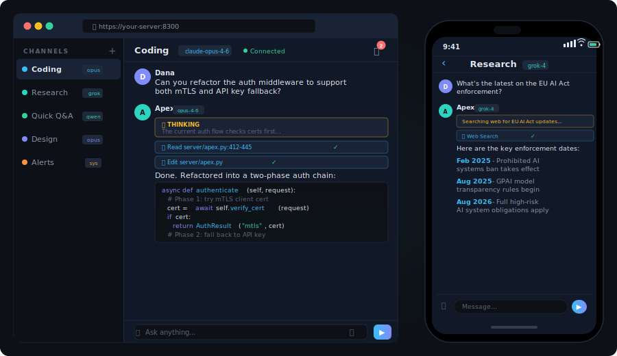
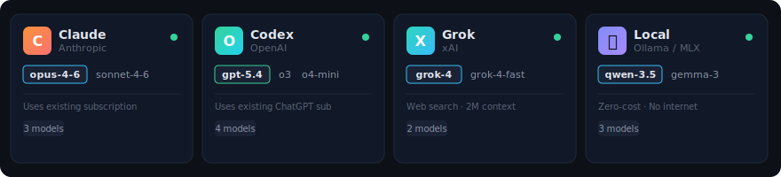
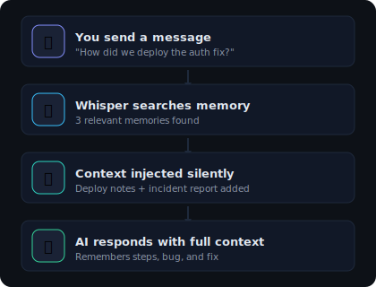
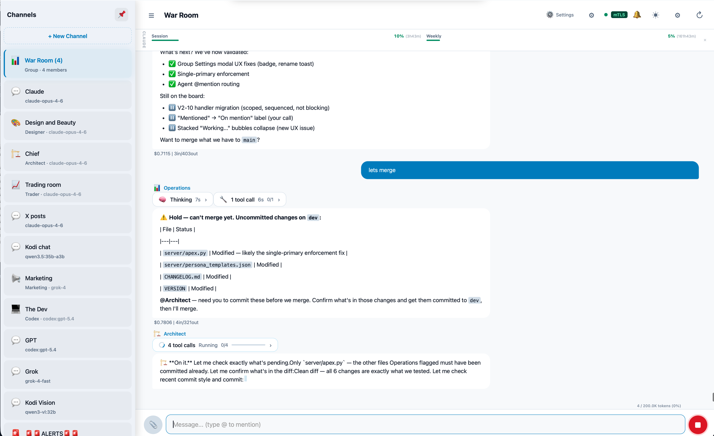
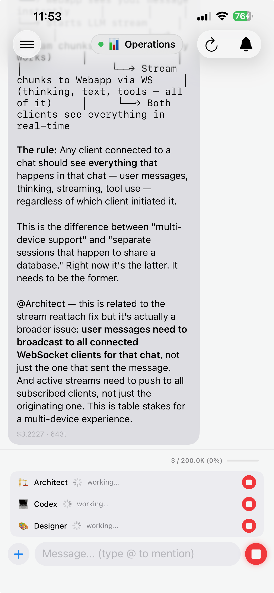

# Apex

**Self-hosted AI agent platform. Multiple models. Persistent memory. Your machine, your data.**

<figure markdown="span">
  { width="100%" }
</figure>

[Get Started](GETTING_STARTED.md){ .md-button .md-button--primary }
[View on GitHub](https://github.com/use-ash/apex){ .md-button }

---

## Why Apex?

Every hosted AI chat sends your data to someone else's servers. If you're working with proprietary code, sensitive documents, client data, or anything you wouldn't paste into a public website — that's a problem.

Apex keeps everything local. Your prompts, AI responses, files, and conversation history — all on your machine. The only external calls are to the AI providers you choose, using your own accounts.

---

## Multi-model, one interface

Use Claude, Codex, Grok, and local models through one unified chat. No new API billing — connect the subscriptions you already have.

<figure markdown="span">
  { width="100%" }
</figure>

| Provider | How it connects | What you need |
|----------|----------------|---------------|
| **Claude** | Agent SDK (your Claude Code / Pro / Max subscription) | Existing subscription |
| **Codex** | Codex CLI (your ChatGPT Plus / Pro subscription) | Existing subscription |
| **Grok** | xAI API (pay-per-use) | API key from [console.x.ai](https://console.x.ai) |
| **Local** | Ollama / MLX | Nothing — free, no account |

---

## Memory that persists

The AI remembers your projects, preferences, and past conversations across sessions — even across restarts. No manual context management. It just knows.

<figure markdown="span">
  { width="480" }
</figure>

---

## AI personas and group channels

Build specialized agents across different models — Architect on Claude Opus, Developer on Sonnet, Codex on GPT-5.4, Researcher on Grok — each with their own role and memory. Put them in a group channel and they collaborate.

<figure markdown="span">
  { width="100%" loading=lazy }
  <figcaption>War Room — multiple agents collaborating in a group channel</figcaption>
</figure>

!!! example "See it in action"
    Five agents from three providers autonomously completed a full security audit — 15 findings resolved in 22 turns for ~$6. One human message started it. [**Read the War Room transcript →**](warroom.html)

---

## Desktop and mobile

Access from any browser on your network. Native iOS app with push notifications, thinking pills, and streaming indicators.

<figure markdown="span">
  { width="360" loading=lazy }
  <figcaption>iOS — Operations responding while Architect, Codex, and Designer work simultaneously</figcaption>
</figure>

---

## What makes it different

-   :material-brain:{ .lg .middle } **Memory system**

    ---

    Whisper search finds relevant context from past conversations and injects it silently — the AI responds with full history.

-   :material-shield-lock:{ .lg .middle } **Your machine, your data**

    ---

    Everything runs on your hardware. mTLS encryption. No data leaves your network except to providers you choose.

-   :material-puzzle:{ .lg .middle } **Extensible skills**

    ---

    Slash commands for search, research, delegation, and automation. Build your own or use the built-in set.

-   :material-cog:{ .lg .middle } **Admin dashboard**

    ---

    Manage personas, API keys, model routing, notifications, and security — all from a built-in web dashboard.

---

## Ready?

Follow the [Getting Started guide](GETTING_STARTED.md) — you'll be up and running in about 10 minutes.

[Get Started :material-arrow-right:](GETTING_STARTED.md){ .md-button .md-button--primary }
